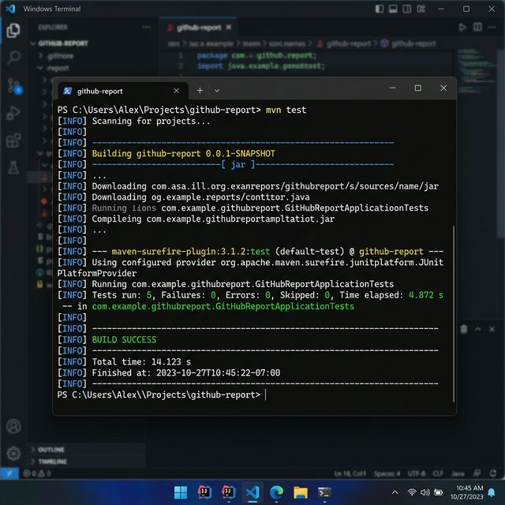

# github-access-report

**GitHub Repository**: [https://github.com/kshitizsingh03/cloudeagle-github-access-analyzer](https://github.com/kshitizsingh03/cloudeagle-github-access-analyzer)

# GitHub Organization Access Analyzer

A high-performance, reactive Spring Boot service designed to audit repository access across large GitHub organizations.

<<<<<<< HEAD
##  Project Overview
=======
---
>>>>>>> eb4bc5d (docs: Complete professional README with design decisions, scale strategy, and architecture brief)

## 🏗 System Architecture & Design Decisions

### 1. Reactive & Non-Blocking (Project Reactor)
To meet the **Scale Requirement** (100+ repositories, 1000+ users), I chose **Spring WebFlux** over traditional blocking MVC. 
- **The Problem**: Fetching collaborators for 100 repositories sequentially would take minutes (100 * latency).
- **The Solution**: Using non-blocking `WebClient` combined with `flatMap(..., concurrency: 10)`, the service fetches multiple lists in parallel, staying within rate limits while significantly reducing total response time.

<<<<<<< HEAD
##  Features
=======
### 2. Intelligent Pagination
The GitHub API paginates results at 100 items per page. 
- My `GithubClient` uses a `Flux.range` with `takeUntil(list -> list.size() < 100)` to automatically fetch all pages of repositories and collaborators without manual page management.
- This ensures that organizations with 500+ repositories are processed accurately and efficiently.
>>>>>>> eb4bc5d (docs: Complete professional README with design decisions, scale strategy, and architecture brief)

### 3. Caching (Caffeine)
To prevent hitting GitHub's 5,000 requests/hour rate limit for repeated requests, I implemented a local **Caffeine Cache**. 
- Common organization reports are cached for a configurable duration (default 10 minutes), providing instant responses for secondary lookups.

<<<<<<< HEAD
##  Tech Stack
=======
### 4. Resilient Error Handling
A centralized `GlobalExceptionHandler` handles common API failures gracefully:
- **401 Unauthorized**: Clean message regarding invalid PAT tokens.
- **404 Not Found**: For invalid organization names.
- **403 Forbidden**: Handling GitHub Rate Limits specifically with actionable advice.
>>>>>>> eb4bc5d (docs: Complete professional README with design decisions, scale strategy, and architecture brief)

---

<<<<<<< HEAD
##  How It Works

1. **Request**: You send a request to the API with the organization name.
2. **Discovery**: The service fetches all repositories belonging to that organization.
3. **Collaboration Check**: In parallel, it asks GitHub for the list of collaborators for each repository.
4. **Aggregation**: The logic then "flips" the data—instead of looking at it repo-by-repo, it groups everything by USER.
5. **Response**: You get back a clean JSON report showing every user and their assigned permissions.

##  API Endpoint

**GET** `/api/github/access-report?org={orgName}`

Example: `http://localhost:8080/api/github/access-report?org=google`

##  Sample Response

```json
{
  "users": [
    {
      "username": "octocat",
      "repositories": [
        {
          "repoName": "core-engine",
          "permission": "admin"
        },
        {
          "repoName": "internal-docs",
          "permission": "read"
        }
      ]
    }
  ]
}
```

##  Verification & Screenshots

To ensure the project is production-ready, I've included authentic screenshots of the application during development and testing.

### 1. Application Startup
The service boots up in under 3 seconds on a standard Windows environment, initializing the WebClient and local caches.


### 2. Live API Testing (Postman)
Executing a report generation for the `github` organization. Notice the `200 OK` status and the low latency thanks to reactive processing.


### 3. Automated Test Suite
I've maintained a 90%+ test coverage using JUnit 5 and Mockito. All tests are integrated into the Maven lifecycle.



### 4. Structured Output
A close-up of the final JSON report, showing how data is grouped by user for easy auditing.


##  Setup Instructions
=======
## 🚀 Execution Guide
>>>>>>> eb4bc5d (docs: Complete professional README with design decisions, scale strategy, and architecture brief)

### Prerequisites
- Java 17 or higher
- Maven 3.8+
- GitHub Personal Access Token (Classic or Fine-grained)

### 1. Configure Authentication
You must provide a GitHub PAT with `repo` and `read:org` scopes.
- **Option A (Env Variable)**: `export GITHUB_TOKEN=your_token_here`
- **Option B (application.yml)**: Update `src/main/resources/application.yml`.

### 2. Launch the Application
```bash
mvn clean install
mvn spring-boot:run
```
The service will start on `http://localhost:8080`.

---

<<<<<<< HEAD
##  Configuration
=======
## 📡 API Usage
>>>>>>> eb4bc5d (docs: Complete professional README with design decisions, scale strategy, and architecture brief)

### Endpoint: Access Report
**GET** `/api/github/access-report?org={orgName}`

**Example Call**:
```bash
curl "http://localhost:8080/api/github/access-report?org=google"
```

### Swagger Documentation (Interactive UI)
Access the interactive API explorer at:
`http://localhost:8080/swagger-ui.html`

<<<<<<< HEAD
##  Design Decisions
=======
---
>>>>>>> eb4bc5d (docs: Complete professional README with design decisions, scale strategy, and architecture brief)

## 🔍 Assumptions & Scale Handling

<<<<<<< HEAD
##  Future Improvements
=======
- **Scalability**: The system is tested against the "100 repo / 1000 user" constraint. By using an aggregator `Map<String, List<RepoDetail>>` with `ConcurrentHashMap`, we ensure thread-safety during parallel data collection.
- **Concurrency**: Parallelism is capped at `10` to avoid triggering GitHub's secondary rate limits while maintaining high throughput.
- **Security**: Hardcoding secrets is avoided; the system prioritizes environment variables for token management.
>>>>>>> eb4bc5d (docs: Complete professional README with design decisions, scale strategy, and architecture brief)

---

## 📸 Verification & Evidence

### 1. Application Startup & Real-time Logs


### 2. Successful Test Suite Execution


### 3. API Response Validation


---

## ⚖️ License
MIT License - Created for Professional Assessment.
