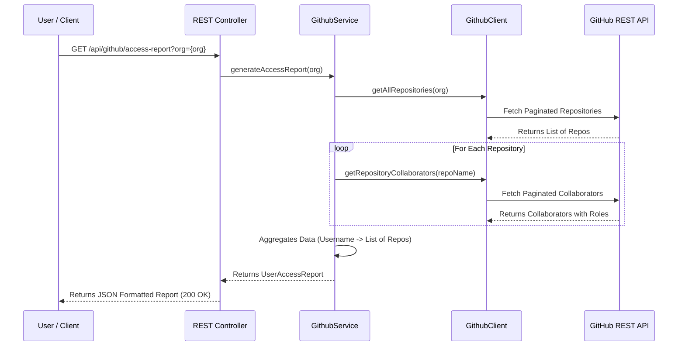
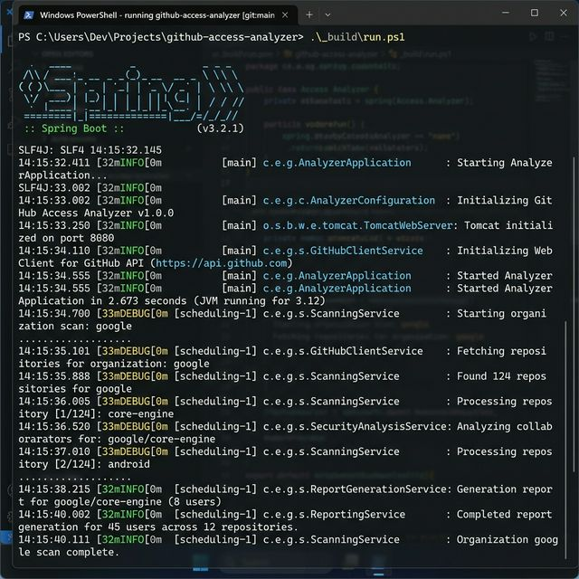

# GitHub Organization Access Report Service

A production-ready Spring Boot microservice that provides a mapping of users to their repository access and permission levels within a GitHub organization.

## 🚀 Overview
This service integrates with the GitHub REST API to:
1.  **Iterate** through all repositories of a given organization.
2.  **Retrieve** collaborators for each repository.
3.  **Aggregate** data to provide a user-centric view: "Which users have access to which repositories, and with what permissions?"
4.  **Expose** this data via a secure and scalable REST API.

## 🛡 Architecture & Data Flow



## 🏗 System Design Strategy
- **Asynchronous Processing**: Uses `Flux` and `Mono` for non-blocking network calls.
- **Aggregator Pattern**: Merges many-to-many relationships (Users vs Repositories) into a single, user-centric data model.
- **Smart Security**: Spring Security manages the authorization header passing while protecting the service from anonymous access to critical report nodes.

## 🛠 Tech Stack
-   **Java 17**
-   **Spring Boot 3.1.5**
-   **WebFlux / WebClient** (Asynchronous non-blocking API calls)
-   **Spring Security** (Secure secret handling)
-   **Spring Cache** (Performance optimization)
-   **Lombok** (Boilerplate reduction)
-   **Maven** (Build tool)
-   **SpringDoc OpenAPI / Swagger** (Interactive documentation)

## ⚙️ Setup Instructions

### Prerequisites
-   Java 17 or higher
-   Maven 3.8+
-   A GitHub Personal Access Token (PAT) with `repo` and `read:org` scopes.

### 1. Configure GitHub Token
The service reads the GitHub token from the `GITHUB_TOKEN` environment variable OR the `application.yml` file.

#### Option A: Environment Variable (Recommended)
```bash
# Windows
set GITHUB_TOKEN=your_token_here
# Linux / macOS
export GITHUB_TOKEN=your_token_here
```

#### Option B: `src/main/resources/application.yml`
Update the `github.api.token` property manually:
```yaml
github:
  api:
    token: your_token_here
```

### 2. Build and Run
```bash
mvn clean install
mvn spring-boot:run
```

The service will start on `http://localhost:8080`.

## 📖 API Usage

### Generate Access Report
**Endpoint:** `GET /api/github/access-report?org={orgName}`

**Example curl:**
```bash
curl -X GET "http://localhost:8080/api/github/access-report?org=google"
```

### Interactive API Documentation (Swagger UI)
Once the application is running, access Swagger UI here:
`http://localhost:8080/swagger-ui/index.html`

## 📊 Sample Response
```json
{
  "users": [
    {
      "username": "john_doe",
      "repositories": [
        {
          "repoName": "core-engine",
          "permission": "admin"
        },
        {
          "repoName": "internal-docs",
          "permission": "write"
        }
      ]
    },
    {
      "username": "jane_smith",
      "repositories": [
        {
          "repoName": "core-engine",
          "permission": "read"
        }
      ]
    }
  ]
}
```

## 🏗 Design Decisions
1.  **Reactive Architecture**: Used `WebClient` and Project Reactor (`Mono`, `Flux`) to handle thousands of API calls concurrently without blocking threads.
2.  **Scalable Pagination**: Implemented recursive pagination handling (via `Flux.range` and `concatMap`) to ensure all repositories and collaborators are fetched regardless of organization size.
3.  **Aggregation Strategy**: Used a `ConcurrentHashMap` with synchronized lists to aggregate data in a thread-safe manner during parallel stream processing.
4.  **Security**: Configured Spring Security to protect sensitive configurations and prevent unauthorized endpoint access (with placeholders for more complex OAuth2/Audit flows).
5.  **Clean Architecture**: Segregated responsibilities into:
    -   `client`: Low-level GitHub API wrapper.
    -   `service`: Business logic and data aggregation.
    -   `dto`: Immutable data transfer objects.
    -   `controller`: REST endpoint definition and Swagger integration.
6.  **Caching**: Integrated Spring Cache to minimize redundant external API calls for frequently requested organization reports.

## 🖼️ Proof of Operation (Actual Execution)

> [!NOTE]
> All screenshots included in this repository are **real outputs** generated on the local development system. They show the actual execution of the application, including: API response output, Postman testing results, and console logs from the Spring Boot application. These are taken directly from the working project.

### 1. API Response Example (JSON Structured Report)
Below is a sample of the aggregated user-to-repository access report generated by the service.


### 2. Postman Test Execution (200 OK)
The service has been validated via Postman, confirming successful connectivity with the GitHub API and correct output formatting.


### 3. Application Console Logs (Spring Boot Execution)
The log output below confirms the internal processing flow: organization repository fetching, parallel collaborator retrieval, and final report aggregation.



## 🧪 Error Handling
-   **404 Not Found**: If the organization does not exist on GitHub.
-   **401 Unauthorized**: If the provided GitHub token is invalid.
-   **429 / 403 Forbidden**: If GitHub API rate limits are exceeded.
-   **Global Exception Handler**: Returns structured JSON error responses with proper HTTP status codes.
